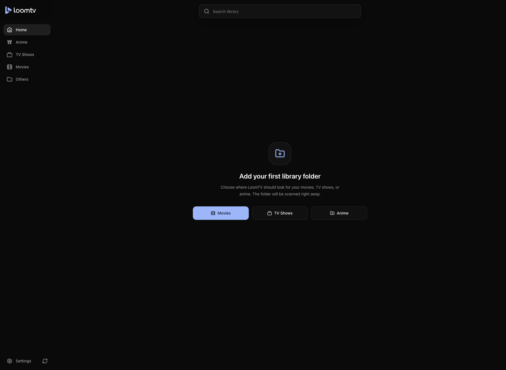
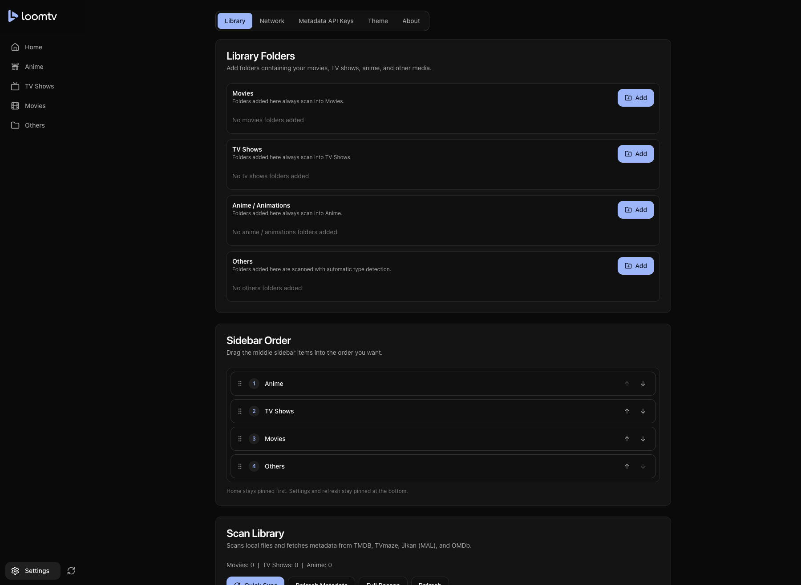

# LoomTV

LoomTV is a desktop media library app for browsing and playing a local collection of movies, TV shows, and anime. It is built with Electron Forge, Vite, React, TypeScript, Tailwind CSS, and a local SQLite-backed library.

This project is for organizing and playing media files that you own, have created, or are otherwise authorized to use. LoomTV does not provide movies, TV shows, anime, streaming subscriptions, or copyrighted media.



## Screenshots

### Empty Library


### Settings




## Features

- Browse separate Movies, TV Shows, and Anime libraries.
- Search across the local library from the home screen.
- Scan local folders and organize media by library type.
- Fetch posters, backdrops, cast data, ratings, and summaries from metadata providers.
- Continue watching with saved playback progress.
- Play local media with stream, transcode, and MPV-backed playback support.
- Generate thumbnails and inspect local media details with bundled FFmpeg/FFprobe resources.
- Customize artwork, theme color, loader style, and sidebar ordering.
- Back up the local database from Settings.

## Download

Prebuilt desktop releases, when available, are published from the repository releases page:

https://github.com/mallenkb/LoomTV/releases

Download the installer or archive for your operating system, then run it like any other desktop app. If no release is available for your platform, build the app locally from source using the instructions below.

## Release Notes

- [LoomTV 1.0.13](docs/releases/v1.0.13.md): fixes macOS relaunch/focus behavior when LoomTV is already running.
- [LoomTV 1.0.12](docs/releases/v1.0.12.md): fixes release CI signing fallbacks and Linux package metadata.
- [LoomTV 1.0.11](docs/releases/v1.0.11.md): improves GitHub-hosted update flow, release packaging, and restart prompts.
- [LoomTV 1.0.10](docs/releases/v1.0.10.md): fixes auto-update detection/install flow for packaged apps using GitHub-hosted releases.
- [LoomTV 1.0.8](docs/releases/v1.0.8.md): fixes installed macOS builds so adding library folders no longer crashes on the packaged SQLite native module.
- [LoomTV 1.0.7](docs/releases/v1.0.7.md): fixes library folder updates so scans no longer overwrite saved library data mid-progress, and clarifies update installation restart state.
- [LoomTV 1.0.6](docs/releases/v1.0.6.md): adds the new theming system, black/default/navy themes, an Others library section, and several playback, metadata, and settings UX fixes.
- [LoomTV 1.0.5](docs/releases/v1.0.5.md): fixes installed-app library add and sync stalls by keeping library payloads lightweight and moving artwork caching out of the blocking scan path.

## Tech Stack

- Electron Forge for the development desktop shell.
- Electron Builder for release packaging and GitHub-hosted auto-update metadata.
- Vite for main, preload, and renderer builds.
- React 19 and React Router for the renderer UI.
- TypeScript for application code.
- Tailwind CSS and local UI components for styling.
- better-sqlite3 for local persistence.
- FFmpeg, FFprobe, HLS.js, and MPV integration for media playback workflows.

## Playback Roadmap

- Short term: keep playback inside LoomTV by using browser-compatible streams and HLS/transcode fallbacks so custom React controls can stay over the video.
- Long term: build a real `libmpv` native addon if LoomTV needs MPV-level playback without opening a separate native player window.

## Getting Started

### Prerequisites

- Node.js and pnpm.
- macOS, Windows, or Linux desktop environment supported by Electron.
- Optional: TMDB and OMDb API keys for richer metadata results.

### Clone and Install

```sh
git clone https://github.com/mallenkb/LoomTV.git
cd LoomTV
corepack pnpm install
```

If you already have the source code, install dependencies from the project root:

```sh
corepack pnpm install
```

### Run in Development

```sh
corepack pnpm start
```

The app opens as an Electron desktop application. Add media folders from Settings, then run a scan to populate the library.

## Build From Source

Local development is powered by Electron Forge. Release builds are generated by Electron Builder so GitHub releases include the update metadata files that `electron-updater` expects.

### Package Locally

```sh
corepack pnpm run package
```

This creates an unpacked local app build under `out/`.

### Create Installers or Archives

```sh
corepack pnpm run dist
```

This creates platform-specific distributables under `out/builder/`.

Configured makers include:

- macOS: DMG and ZIP archive, including `latest-mac.yml` update metadata.
- Windows: NSIS installer, including `latest.yml` update metadata.
- Linux: AppImage, DEB, and RPM packages. AppImage builds can participate in the updater flow.

### Publish

```sh
corepack pnpm run publish
```

Publishes distributables through Electron Builder's GitHub publisher. Publishing requires `GH_TOKEN` or `GITHUB_TOKEN` with release permissions.

For release automation:

1. Bump version with `pnpm version 1.0.12` (or the next patch/minor version).
2. Push commit and create/push a tag that matches `v*`:

   ```sh
   git push origin main
   git push origin v1.0.12
   ```

3. The workflow in `.github/workflows/build-installers.yml` runs on tag pushes. Electron Builder creates and uploads macOS/Windows/Linux installers plus updater metadata (`latest*.yml`, `.blockmap`) to the GitHub release.

### Auto-update behavior

- `electron-updater` checks once at startup (when packaged) and every 6 hours in the background.
- You can also use **Check for Updates…** from the app menu or the Settings update card.
- While an update downloads, LoomTV shows a small, quiet update affordance instead of interrupting playback or browsing.
- After a package is downloaded, LoomTV prompts to restart now. If you skip, the update remains ready in-app until installed later.

- Requirements:
  - GitHub releases must be published with version tags like `v1.0.12`.
  - Release assets must include install artifacts and Electron Builder update metadata files (workflow is configured for this).
  - macOS/Windows release builds should be signed in CI for reliable install/update trust.
  - mac signing: configure Electron Builder signing secrets such as `CSC_LINK` and `CSC_KEY_PASSWORD`; notarization also needs Apple credentials such as `APPLE_ID`, `APPLE_APP_SPECIFIC_PASSWORD`, and `APPLE_TEAM_ID`.
  - Windows signing: configure Electron Builder signing secrets such as `CSC_LINK` and `CSC_KEY_PASSWORD`.

## Metadata Setup

LoomTV can enrich local files with artwork and metadata. Open Settings, then add provider keys under "Metadata API Keys".

- TMDB is recommended for movie and TV posters, backdrops, cast info, ratings, and summaries.
- OMDb is available as an optional fallback provider.
- TVmaze and Jikan/MyAnimeList are used for TV and anime metadata flows where available.

## Scripts

- `corepack pnpm start`: start the Electron Forge development app.
- `corepack pnpm run package`: create an unpacked local application build.
- `corepack pnpm run make`: create Electron Forge distributables for local/package testing.
- `corepack pnpm run dist`: create Electron Builder release artifacts without publishing.
- `corepack pnpm run publish`: create and publish Electron Builder release artifacts.
- `corepack pnpm run release:all-platforms`: alias for the Electron Builder release path used by CI.
- `corepack pnpm run lint`: run ESLint across TypeScript and TSX files.

## Project Structure

```text
src/
  components/    Reusable renderer UI components.
  contexts/      React state providers for the media library.
  lib/           Renderer utilities and desktop API bridge.
  main/          Electron main process, database, playback, probing, and transcode code.
  pages/         App screens for Home, Movies, TV, Anime, Details, and Settings.
resources/
  ffmpeg/        Bundled FFmpeg and FFprobe resources and notices.
```

## Building and Packaging

The Forge configuration packages the app with ASAR enabled and includes media tooling resources from `resources/ffmpeg`. Platform makers are configured for ZIP on macOS, Squirrel on Windows, and DEB/RPM on Linux.

## Third-Party Notices

LoomTV depends on open-source desktop, UI, database, and media libraries. Important runtime dependencies include Electron, Electron Forge, React, React Router, Vite, TypeScript, Tailwind CSS, better-sqlite3, HLS.js, Motion, Lucide React, ffmpeg-static, and ffprobe-static.

The application also includes local UI component patterns inspired by shadcn/ui.

### FFmpeg and FFprobe

LoomTV bundles FFmpeg and FFprobe command line tools so users do not need to install FFmpeg separately.

- FFmpeg is a trademark of Fabrice Bellard, originator of the FFmpeg project.
- LoomTV is not affiliated with the FFmpeg project.
- Bundled FFmpeg builds may include GPL components and are distributed under the GNU General Public License version 3 or later, as applicable to those builds and their included libraries.
- LoomTV invokes FFmpeg as separate command line executables. The FFmpeg binaries remain third-party software owned by their respective copyright holders.

See `resources/ffmpeg/NOTICE.md` for bundled build details, source references, and download URLs. See `resources/ffmpeg/COPYING.GPLv3.txt` for the GPLv3 license text.

### Metadata Providers

LoomTV may use third-party metadata providers to retrieve artwork, summaries, ratings, and related media information.

- TMDB: movie and TV posters, backdrops, cast data, ratings, and metadata.
- TVmaze: TV show and episode metadata.
- Jikan / MyAnimeList: anime posters, ratings, and anime metadata.
- OMDb API: fallback movie and TV metadata.

LoomTV is not affiliated with, endorsed by, or sponsored by these providers. Use of provider data and API keys is subject to each provider's own terms, attribution rules, rate limits, and privacy policies.

## Disclaimers

- LoomTV is a local media manager and player. It does not provide, host, sell, stream, or download copyrighted movies, TV shows, anime, subtitles, or other media.
- You are responsible for ensuring that the media files, subtitles, metadata, and artwork you use with LoomTV are lawful for you to access and use.
- API keys are your responsibility. Keep provider keys private and follow the terms of the providers you connect.
- Local playback, transcoding, and metadata matching can vary by file format, codec, operating system, and bundled or system media tools.
- This software is provided as-is, without warranty of any kind.

## License and Copyright

Copyright (c) 2026 malllenkb

LoomTV source code is licensed under the MIT License. See `LICENSE` for the full license text.

```text
MIT License

Copyright (c) 2026 malllenkb

Permission is hereby granted, free of charge, to any person obtaining a copy
of this software and associated documentation files (the "Software"), to deal
in the Software without restriction, including without limitation the rights
to use, copy, modify, merge, publish, distribute, sublicense, and/or sell
copies of the Software, and to permit persons to whom the Software is
furnished to do so, subject to the following conditions:

The above copyright notice and this permission notice shall be included in all
copies or substantial portions of the Software.

THE SOFTWARE IS PROVIDED "AS IS", WITHOUT WARRANTY OF ANY KIND, EXPRESS OR
IMPLIED, INCLUDING BUT NOT LIMITED TO THE WARRANTIES OF MERCHANTABILITY,
FITNESS FOR A PARTICULAR PURPOSE AND NONINFRINGEMENT. IN NO EVENT SHALL THE
AUTHORS OR COPYRIGHT HOLDERS BE LIABLE FOR ANY CLAIM, DAMAGES OR OTHER
LIABILITY, WHETHER IN AN ACTION OF CONTRACT, TORT OR OTHERWISE, ARISING FROM,
OUT OF OR IN CONNECTION WITH THE SOFTWARE OR THE USE OR OTHER DEALINGS IN THE
SOFTWARE.
```

Bundled third-party tools and dependencies remain under their own licenses. In particular, bundled FFmpeg/FFprobe builds are covered by their applicable FFmpeg and GPL notices as described above.
