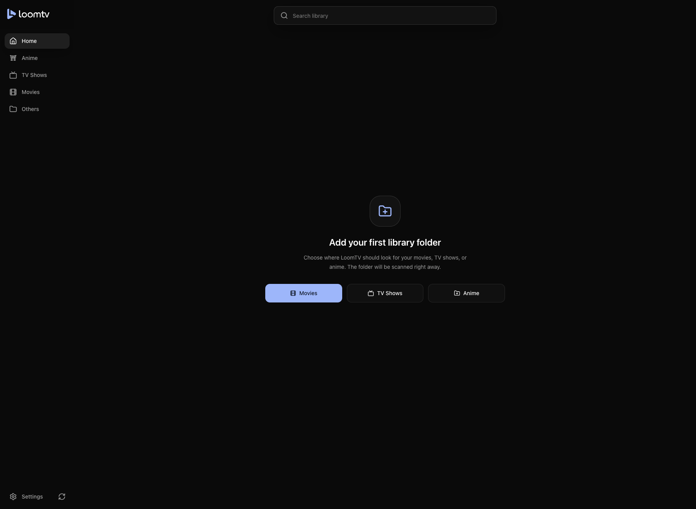
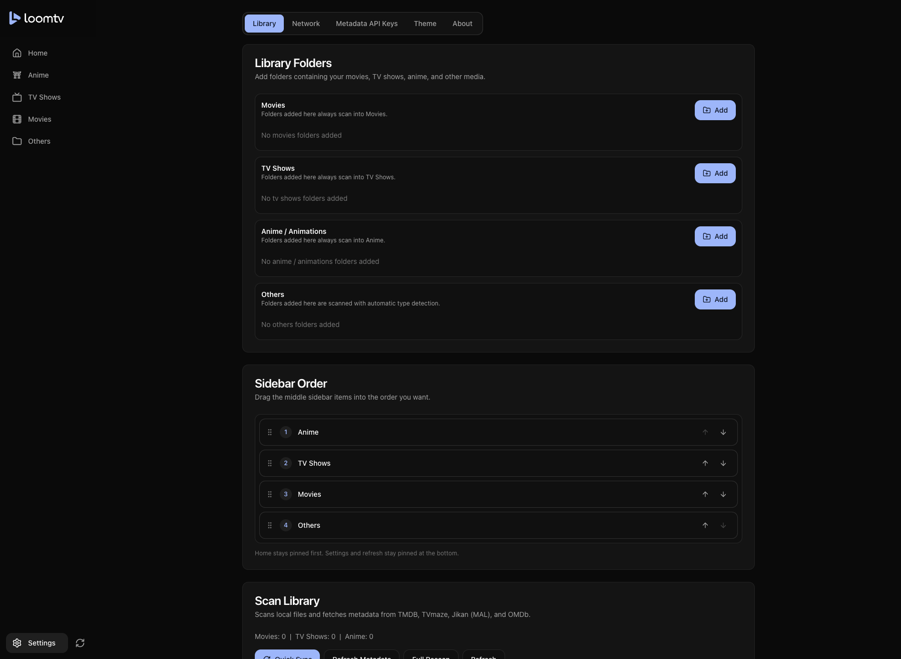

# Loom

Loom is a private media library for video, photos, music, and reading. The Electron app organizes files stored on your computer or an OS-mounted server folder.

Loom does not provide media or streaming subscriptions. Use it only with files and streams you own, created, or are allowed to access.

[Release notes](CHANGELOG.md)



## What Loom does

- Scans local folders and NAS paths into separate Movies, TV Shows, Anime, and custom libraries.
- Fetches titles, summaries, ratings, cast details, posters, backdrops, and clearlogos from supported metadata providers.
- Saves watch progress, lists, profiles, PINs, and playback preferences in one SQLite database.
- Supports household accounts, multiple administrators, device pairing, and private invitations.
- Plays local desktop files through LibVLC when available, then mpv, then Chromium or HLS.
- Serves the same library to the hosted web app, iOS and Android app, and Android TV or Fire TV app.
- Supports direct streaming, transcoding, subtitles, offline downloads, and browser casting where the client allows it.
- Runs inside the desktop app or as a headless service on a NAS or always-on computer.
- Includes a Discover page for browsing public catalogs (TMDB, AniList, Cinemeta) and the Internet Archive's Feature Films collection. See [Discover and add-ons](#discover-and-add-ons).

Video is the established library experience. Electron media expansion is starting with Photos, followed by Music, Audiobooks, Books, and Comics and manga. See the [execution plan](docs/multimedia-execution-plan.md) for scope and implementation status. These media types are not yet advertised as released support.

## Where it runs

| Surface | Purpose |
| --- | --- |
| Desktop | Runs Loom Media Server and the Loom desktop client together on macOS, Windows, or Linux. |
| Headless server | Runs without Electron on a NAS, home server, or Linux host. |
| Web | Opens the library at `/app/` and server controls at `/admin/`. |
| Mobile | Connects from iOS or Android, with profile support and offline downloads. |
| TV | Connects from Android TV or Fire TV with remote-friendly navigation. |

The desktop and headless versions use the same server, API, accounts, and database model. Before startup, the desktop app can migrate older LoomTV data into that shared database.

Some internal package names still use `loom-media-server`. The installed product is Loom. The server component is Loom Media Server. Existing application IDs, data paths, and update identifiers remain unchanged for upgrade safety.

See the [platform capability matrix and verification notes](docs/platform-capabilities.md) for client differences and checks that still need device verification.

## Install a release

Download a build from [GitHub Releases](https://github.com/mallenkb/LoomTV/releases). Choose the installer or archive for your operating system.

Unsigned builds can trigger an operating-system warning. A normal public macOS release needs Developer ID signing and Apple notarization. Windows trust also depends on release signing.

## Run the desktop app from source

### Requirements

- Node.js 22
- Corepack
- macOS, Windows, or Linux with a desktop environment supported by Electron

Clone the repository, install the workspace, and start Loom:

```sh
git clone https://github.com/mallenkb/LoomTV.git
cd LoomTV
corepack pnpm install
corepack pnpm start
```

The desktop app starts Loom Media Server and opens the Loom client. Add media folders during setup or from Settings, then scan the library.

## Run the headless server

Install the workspace and start the server from the repository root:

```sh
corepack pnpm install
corepack pnpm server:start
```

The default local routes are:

- Viewer: `http://127.0.0.1:3847/app/`
- Administration: `http://127.0.0.1:3847/admin/`
- Health check: `http://127.0.0.1:3847/healthz`

The address and port can be changed with the server configuration. For Docker, systemd, storage layout, permissions, backups, and hardware transcoding, read the [NAS deployment guide](docs/nas-deployment.md).

Mount SMB or NFS shares on the host, then give Loom Media Server the mounted path. Loom does not mount network shares or store NAS credentials. If a share goes offline, its library records stay in the database and can be scanned again after the path returns.

Keep a headless server on your LAN unless you have deliberately configured HTTPS, authentication, a trusted reverse proxy or VPN, and remote-access policy. Do not expose the server port directly to the public internet.

## Playback

Local desktop playback uses this order:

1. LibVLC in the Loom player on supported macOS and Windows builds.
2. A packaged, user-selected, or system mpv runtime.
3. Chromium direct playback or an FFmpeg-backed HLS stream.

Browser and remote clients use authenticated direct playback when their capabilities match the file. Otherwise, the server remuxes or transcodes the video through HLS. Audio tracks, subtitle tracks, playback progress, and resume position remain part of the Loom session.

The desktop build downloads LibVLC, libmpv, and FFmpeg for Apple silicon Macs and x64 Windows from a pinned GitHub release on this repository and checks each archive's SHA-256 before using it (`apps/desktop/native-runtimes.json`). The first `corepack pnpm start` downloads about 140 MB on macOS and 125 MB on Windows; later runs reuse a cache in `~/.cache/loom-native-runtimes`. The application itself never downloads LibVLC or mpv. The bundled libmpv requires macOS 26 or later; older Macs use LibVLC, then Chromium or HLS. Other machines, such as Intel Macs, get no bundled runtimes: `corepack pnpm start` warns and plays through Chromium or HLS, and packaging fails with an explicit error.

## Metadata

Provider setup is optional. TVmaze and Jikan work without user API keys. TMDB, Fanart.tv, and OMDb can be added during setup or later in Settings.

| Provider | Used for |
| --- | --- |
| TMDB | Movie and TV metadata, artwork, cast, and ratings |
| TVmaze | TV show and episode metadata without a user key |
| Jikan / MyAnimeList | Anime metadata without a user key |
| Fanart.tv | Clearlogos and media-center artwork |
| OMDb | Fallback movie and TV details and ratings |

Fetched metadata and selected artwork are stored with the library. Normal browsing reads that saved data instead of calling providers for every screen. A scan or manual metadata refresh can update it.

## Discover and add-ons

The Discover page shows titles from public catalogs so you can find something to add to your library or watch list. It uses TMDB and AniList for browsing and Cinemeta for metadata. None of these catalogs provides video.

Two kinds of source can play from Discover:

- The built-in Internet Archive catalog, limited to its Feature Films collection with adult content filtered out. The Internet Archive hosts these films for free public viewing.
- Stremio-compatible add-ons you install yourself by manifest URL in Settings. Loom plays their HTTPS and HLS streams and always refuses torrent and peer-to-peer sources.

Loom ships no add-on that provides commercial films or series. An add-on you install decides what it streams, so install only add-ons whose sources you are allowed to watch.

## Screenshots

<details>
<summary>Open screenshots</summary>

### Library settings


### Network settings


### Theme settings



### About and updates


</details>

## Common commands

Run commands from the repository root.

| Command | Action |
| --- | --- |
| `corepack pnpm start` | Start the desktop app |
| `corepack pnpm server:start` | Start the headless server |
| `corepack pnpm mobile:start` | Start the Expo mobile project |
| `corepack pnpm tv:start` | Start the Android TV or Fire TV project |
| `corepack pnpm --filter loom-media-server-desktop package` | Create an unpacked desktop build |
| `corepack pnpm --filter loom-media-server-desktop make` | Create Electron Forge distributables |
| `corepack pnpm --filter loom-media-server-desktop dist` | Create Electron Builder release files without publishing |
| `corepack pnpm typecheck` | Run workspace TypeScript checks |
| `corepack pnpm test` | Run workspace tests |

Desktop build output goes to `apps/desktop/out/`. Electron Builder writes installers and archives to `apps/desktop/out/builder/`.

## Repository map

```text
apps/
  desktop/       Electron host, desktop UI, native playback, and packaging
  server/        Main server, API, setup, hosted app, and admin UI
  mobile/        Expo app for iOS and Android
  tv/            Expo app for Android TV and Fire TV
packages/
  video-contracts/        Shared API and playback contracts
  media-core/             Media identity, classification, and playback planning
  runtime-paths/          Shared data, cache, and media path resolution
  transcode-capabilities/ Client capability and transcode decisions
  lan-protocol/           LAN discovery, pairing, and transport types
  plugin-protocol/        Plugin protocol and sandbox types
  video-migration/        Canonical state migration helpers
deploy/
  docker/        Headless Docker files
  systemd/       Linux service files
docs/            Deployment, architecture, status, security, and release notes
scripts/         Release, policy, audit, and evidence tools
```

The recursive test command covers every workspace. `scripts/verify-test-workspaces.cjs` fails the run if a workspace loses its test script or a new one is left unclassified.

## Packaging and releases

Local packaging never publishes a release:

```sh
corepack pnpm --filter loom-media-server-desktop run package
corepack pnpm --filter loom-media-server-desktop run dist
```

The release workflow publishes tagged builds for macOS, Windows, and Linux. It checks that the desktop version, tag, and release-note file agree before uploading installers and updater metadata.

For a release:

1. Set the desktop version with `corepack pnpm --filter loom-media-server-desktop version X.Y.Z --no-git-tag-version`.
2. Add `docs/releases/vX.Y.Z.md`.
3. Commit the version, lockfile, and release notes to `main`.
4. Create and push an annotated `vX.Y.Z` tag.

```sh
git tag -a vX.Y.Z -m 'LoomTV X.Y.Z'
git push origin vX.Y.Z
```

GitHub Actions handles publishing. Signing credentials are optional to the workflow, but unsigned builds will show platform trust warnings. The workflow and signing rules live in [`.github/workflows/release.yml`](.github/workflows/release.yml), and rollback guidance lives in [`docs/security/release-rollback.md`](docs/security/release-rollback.md).

The release history lives in [`CHANGELOG.md`](CHANGELOG.md).

## Documentation

- [Video feature status](docs/loomtv-vs-jellyfin-feature-status.md): what is implemented, what has automated evidence, and what still needs device testing.
- [Product structure](docs/product-structure.md): how Loom, Loom Media Server, and the media libraries fit together.
- [Media library expansion](docs/multimedia-execution-plan.md): the Electron-only delivery order and photo milestone.
- [Hosted API](docs/hosted-api.md): authentication, playback plans, downloads, private sharing, and remote access.
- [NAS deployment](docs/nas-deployment.md): Docker, systemd, storage, permissions, backups, and hardware access.
- [Canonical migration](docs/canonical-migration.md): migration and rollback behavior for older installations.
- [Future work](docs/future-work.md): planned work that is not part of the current product.
- [Release notes](CHANGELOG.md): recent changes and links to every version.

## License and third-party software

Copyright (c) 2026 malllenkb

LoomTV-authored source code and documentation use the [MIT License](LICENSE).

Bundled software keeps its own license. This includes LibVLC, mpv, FFmpeg, FFprobe, fpcalc, application dependencies, and avatar artwork. Provider data and API access also remain subject to each provider's terms.

Read [`THIRD_PARTY_NOTICES.md`](THIRD_PARTY_NOTICES.md) for the dependency and service inventory. Native runtime builds carry more specific notices under [`apps/desktop/resources`](apps/desktop/resources/).

LoomTV is not affiliated with VideoLAN, FFmpeg, TMDB, TVmaze, MyAnimeList, Jikan, Fanart.tv, or OMDb.
