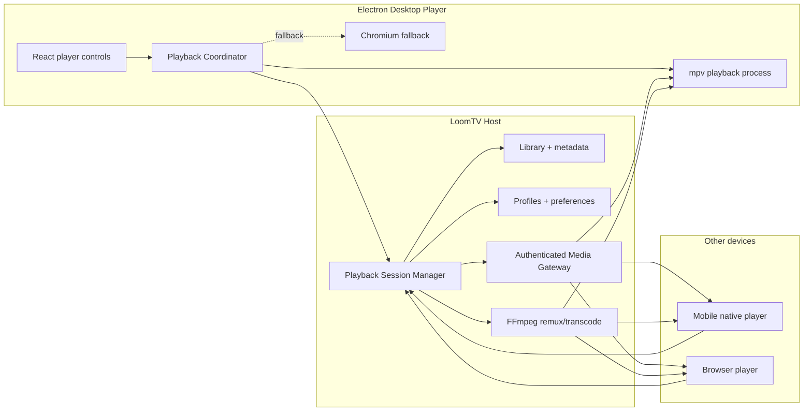

# LoomTV mpv Playback Architecture Plan

**Status:** proposal · revision 2
**Supersedes:** the initial mpv architecture draft

The target is a hybrid Plex/Jellyfin-style architecture:

- LoomTV remains the media server and product experience.
- mpv becomes the native playback engine for desktop.
- FFmpeg remains the compatibility and remote-transcoding engine.
- Browser and mobile clients keep their native player plus HLS fallback.

mpv does not replace the LoomTV server.

---

## 0. What this revision changes

Revision 1 was sound on architecture but wrong on sequencing, and it attributed one
current bug to the wrong layer. This revision:

1. **Adds a blocking licensing gate as Phase 0.** GPL vs LGPL is a product-level
   decision that can invalidate the whole plan. It cannot sit in the packaging phase.
2. **Moves the direct-play fix ahead of the mpv migration.** Most of the felt
   slowness is a bypass in the *existing* FFmpeg pipeline and needs no new runtime.
3. **Corrects the subtitle diagnosis.** Subtitles are not failing to render. They are
   failing to be *selected*. mpv does not fix this; the selection heuristic does.
4. **Records what is already built** (§2), which is more than revision 1 assumed.
5. Scopes `transparent: true` to the player window instead of the whole app.
6. Adds HDR tone-mapping and lossless audio passthrough as first-class motivations.

See [Appendix A](#appendix-a-measured-evidence) for the measurements behind these changes.

---

## 1. Target architecture



### Playback by client

| Client | Preferred playback | Fallback |
|---|---|---|
| Host desktop | mpv opens the local file directly | Current Chromium/HLS player |
| Remote desktop | mpv reads an authenticated HTTP-range stream | Remux or HLS transcode |
| Mobile | Native platform direct play | HLS/remux/transcode |
| Browser | Browser-compatible direct play | HLS/remux/transcode |

Direct play first, remux second, transcode only when necessary — the same principle as
[Jellyfin's playback modes](https://jellyfin.org/docs/general/post-install/transcoding/).

### Why mpv, beyond latency

Instant track switching is the headline win, but two capabilities are unreachable in
Chromium at any effort level and should be counted as part of the return:

- **HDR tone-mapping.** mpv tone-maps HDR10/HLG to SDR displays correctly. Chromium
  either washes out or clips. Today the only alternative is an FFmpeg tone-map filter,
  which forces a full transcode.
- **Lossless audio passthrough.** mpv can bitstream DTS-HD/TrueHD to a receiver.
  The browser path must always decode and re-encode.

---

## 2. Current state

More of Phase 1–2 exists than revision 1 assumed. Verified in the working tree:

| Piece | Location | State |
|---|---|---|
| mpv sidecar adapter | `apps/desktop/src/main/mpvPlayback.ts` | ~384 lines, untracked. Spawns mpv with `--no-border` and `--input-ipc-server`, connects over `net.createConnection` |
| Typed IPC channels | `apps/desktop/src/shared/ipcContract.ts` | `mpv:availability`, `mpv:start`, `mpv:command`, `mpv:stop`, plus the `mpv:state` event |
| Command union | `apps/desktop/src/shared/desktopProtocol.ts` | `MpvCommand` covers pause, seek, volume, mute, speed, video/audio/primary/secondary-subtitle selection, subtitle delay, subtitle style, aspect, crop, rotation |
| Player state | `apps/desktop/src/shared/desktopProtocol.ts` | `MpvPlaybackState`, `MpvPlaybackTrack` |
| Window transparency | `apps/desktop/src/main/windowManager.ts` | `transparent: true` — **currently on the main app window** |
| Bundled mpv binary | `apps/desktop/resources/` | Not present |
| Renderer integration | `VideoPlayer.tsx` | Not wired; still Chromium/HLS only |

### Known gaps in the existing surface

- `MpvPlaybackTrack` has `external?: boolean` but no `source` discriminator, so it
  cannot distinguish a hand-placed sidecar from an OpenSubtitles download (§5).
- `MpvCommand` has `set-subtitle-delay` but no `set-audio-delay`, which the
  `PlaybackEngine` interface in §4 requires.
- `transparent: true` belongs on a dedicated player window. Applied to the main
  window it affects every screen, and on macOS transparent windows give up some
  compositing fast paths.

---

## 3. Application boundaries

### A. LoomTV server core

Continues owning library scanning and metadata, profiles and watch history, device
pairing and authorization, Continue Watching, episode ordering, track preferences,
streaming sessions, FFmpeg processes, and the LAN/remote APIs.

The server should not know how the desktop UI renders video. It produces a playback plan.

### B. Playback Session Manager

One central service decides how every client receives media.

```ts
type PlaybackRequest = {
  mediaId: string;
  fileId: string;
  startSeconds?: number;
  client: PlaybackCapabilities;
  network: {
    kind: 'local-file' | 'lan' | 'remote';
    maximumBitrate?: number;
  };
};

type PlaybackCapabilities = {
  engine: 'mpv' | 'browser' | 'ios-native' | 'android-native';
  containers: string[];
  videoCodecs: string[];
  audioCodecs: string[];
  subtitleCodecs: string[];
  supportsEmbeddedTracks: boolean;
  supportsSecondarySubtitles: boolean;
  supportsHdr: boolean;
};

type PlaybackPlan = {
  sessionId: string;
  mode: 'local-file' | 'direct' | 'remux' | 'transcode';
  source: {
    filePath?: string;
    url?: string;
    headers?: Record<string, string>;
  };
  startSeconds: number;
  tracks: PlaybackTrack[];
  reason: string;
};
```

This replaces renderer-specific questions such as "is this safe for Chromium?" with
capability-based planning.

`apps/desktop/src/main/transcodeDecisionCore.ts` is the seed of this. It already
produces `direct` / `remux` / `direct-stream` / `transcode` with a `reason`, but its
codec tables are hardcoded to the browser profile. Phase 3 generalizes it to accept a
`PlaybackCapabilities` argument rather than rewriting it.

### C. Desktop Playback Coordinator

A main-process service owning the active player session: start/stop mpv, load local
paths or remote URLs, relay renderer commands, subscribe to mpv events, restore
position/volume/track preferences, handle next-episode transitions, keep fullscreen
across episodes, fall back to Chromium when mpv is unavailable, and report progress to
the existing profile database.

The renderer never controls mpv directly. Everything crosses the existing
preload/IPC boundary, which is already typed and allowlisted.

---

## 4. mpv integration model

### Isolated mpv process (already the chosen approach)

Bundle the mpv executable and control it over JSON IPC — Unix socket on macOS/Linux,
named pipe on Windows.

```text
Electron renderer
    ↓ typed IPC
Electron main process
    ↓ PlaybackCoordinator
MpvProcessAdapter
    ↓ JSON IPC socket/named pipe
Bundled mpv process
```

This is the right call, and more strongly than revision 1 argued: **this repo already
has an Electron-ABI native-module problem.** `better-sqlite3` is rebuilt for Electron's
ABI by `pnpm start`, which silently breaks `pnpm test` under plain Node. A libmpv N-API
addon would add a second, larger instance of that failure mode. Process isolation also
means an mpv crash on a malformed file cannot take down the media server that a paired
phone is streaming from.

Other advantages: one command protocol across platforms, independent binary
upgrade/rollback, and a faster path to a working proof of concept.

### Presentation model

Displaying mpv while keeping LoomTV's React controls is the hard part.

1. A dedicated borderless native window managed by mpv.
2. A transparent Electron controls window above it.
3. Bounds, fullscreen state, focus, and visibility synchronized between them.
4. React renders controls, settings, episode lists, overlays.
5. mpv renders video and native subtitles only.

**On macOS this design is forced, not chosen.** mpv's `--wid` embedding is unsupported
on macOS, so there is no single-window option short of a libmpv render-API integration
against a shared texture. Windows and X11 could use `--wid`, but maintaining two
presentation models is worse than maintaining one.

Budget the window work as real engineering, not a spike. The failure modes that sink
these integrations are all in this layer:

- Fullscreen enter/exit transition timing (the two windows animate independently).
- macOS Spaces and Mission Control.
- Moving between monitors with different DPI or refresh rates.
- Display sleep/wake and resolution changes.
- Z-order fights when another app takes focus.
- Click-through and hit-testing on the transparent layer.

Keep everything behind a `PlaybackEngine` interface so a future libmpv render
integration can replace the sidecar without touching React:

```ts
interface PlaybackEngine {
  load(source: PlaybackSource): Promise<void>;
  play(): Promise<void>;
  pause(): Promise<void>;
  seek(seconds: number): Promise<void>;
  selectAudio(trackId: string): Promise<void>;
  selectSubtitle(trackId: string | null): Promise<void>;
  selectSecondarySubtitle(trackId: string | null): Promise<void>;
  setSubtitleDelay(seconds: number): Promise<void>;
  setAudioDelay(seconds: number): Promise<void>;
  setVolume(volume: number): Promise<void>;
  destroy(): Promise<void>;
}
```

mpv officially recommends libmpv when used as another application's backend; the
adapter boundary is what makes starting with process IPC a reversible decision.
See the [mpv manual](https://mpv.io/manual/stable/).

---

## 5. Track architecture

During direct playback mpv becomes the source of truth for tracks. After
`file-loaded`, LoomTV reads mpv's track list and normalizes it:

```ts
type PlaybackTrack = {
  id: string;
  mpvId?: number;
  ffmpegIndex?: number;
  type: 'video' | 'audio' | 'subtitle';
  source: 'embedded' | 'sidecar' | 'opensubtitles';
  language?: string;
  title?: string;
  codec?: string;
  channels?: number;
  default: boolean;
  forced: boolean;
  external: boolean;
  /** Signs-and-songs, karaoke, or typesetting only — carries no dialogue. */
  signsOnly?: boolean;
};
```

Labelling then becomes unambiguous:

- `Japanese · AAC 2.0 · Embedded`
- `English · ASS · Embedded`
- `English · ASS · Embedded · Signs & Songs`
- `English · SRT · Local file`
- `English · SRT · OpenSubtitles`

### Distinguishing subtitle sources requires a server change

OpenSubtitles downloads are written to disk beside the video as
`<basename>.<lang>.srt`, then rediscovered on the next scan by the same code path as a
hand-placed sidecar. The record shape is `{ lang, label, url }` with no origin field,
so the two are **currently indistinguishable by construction** — no UI change alone can
fix it.

Add an optional `source` to the subtitle record, set it at download time, and default
unmarked files to `'sidecar'`. Optional keeps it migration-free.

### Selection must not trust `default`

Release groups routinely ship a signs-and-songs track — on-screen text and karaoke,
no dialogue — and flag it `default`. Honouring that flag renders a subtitle track that
appears blank for most of an episode. This is the actual cause of the current
"subtitles don't show" report; see [Appendix A](#appendix-a-measured-evidence).

Selection order for subtitles:

1. Explicit user selection for this episode.
2. Series preference, then profile preference.
3. A dialogue-bearing track (not `forced`, not signs-only) that is `default`.
4. A dialogue-bearing track matching the preferred language.
5. Any dialogue-bearing track.
6. Only then a forced or signs-only track.

Signs-only detection is a title heuristic (`signs`, `songs`, `s&s`, `karaoke`,
`typesetting`), explicitly overridden when the title also says `full`, `dialogue`, or
`complete`.

### Instant switching

For direct mpv playback: audio changes `aid`, primary subtitles change `sid`,
secondary subtitles change `secondary-sid`, external subtitles use `sub-add`. No video
reload, no FFmpeg restart, position unchanged.

A restart is still required when the client consumes a single-audio HLS transcode,
bitmap subtitles must be burned in, audio must be transcoded to a compatible codec, or
the selected quality/bitrate changes. Show a brief "Preparing track…" state only in
those cases.

---

## 6. Track preference persistence

Layered resolution: explicit episode selection → series preference → profile
preference → file default → first compatible track.

Persist semantics, not indexes — ordering changes when a file is replaced or remuxed:

```ts
type TrackPreference = {
  language?: string;
  title?: string;
  codec?: string;
  source?: 'embedded' | 'sidecar' | 'opensubtitles';
  forced?: boolean;
};
```

Store preferred audio language, preferred subtitle language, subtitle behavior
(off / forced-only / always-on), primary and secondary subtitle preferences, subtitle
style, subtitle and audio delay, and optional series overrides. Preferences apply
automatically on next-episode load without leaving fullscreen.

The existing `saveTrackPreference` already stores semantic fields; extend rather than
replace it.

---

## 7. Media delivery

### Local host playback

Give mpv the real filesystem path: lowest startup latency, no local HTTP overhead, all
embedded tracks available, seeking via the original container index, no FFmpeg process.
Only the trusted main process ever sees the path.

### Remote desktop playback

The host serves a signed direct-play URL:

```text
GET /api/v2/playback/{sessionId}/source
Authorization: Bearer <device-session>
Range: bytes=...
```

Requirements: HTTP range requests, correct content length and MIME type, HEAD support,
short-lived session tokens, connection cancellation, seekable responses, no filesystem
paths exposed to remote clients, original container and all embedded tracks preserved.

### Remux

Client cannot consume the container but supports the streams: copy video, copy
compatible audio, change container only, never encode video.

### Transcode

FFmpeg only when the codec is unsupported, bandwidth is insufficient, resolution must
drop, HDR tone-mapping is needed, the audio layout is unsupported, or subtitles must be
burned in. The existing FFmpeg/HLS pipeline stays.

### Concurrency

The desktop can now be both a local mpv player and a transcoding host for paired
devices. `ffmpegGovernor`'s slot limits were sized assuming the desktop's own playback
consumed a slot. Revisit them so local mpv playback does not starve a phone mid-episode,
and so a LAN transcode does not stall a local seek.

---

## 8. Renderer refactor

`VideoPlayer.tsx` is ~2,620 lines mixing UI, browser playback, stream lifecycle, track
state, and episode transitions. It has 46 `useState` and 27 `useEffect` hooks. Split it:

```text
VideoPlayer/
  VideoPlayerShell.tsx
  PlaybackViewport.tsx
  PlayerControlBar.tsx
  PlayerSettingsPanel.tsx
  PlayerEpisodePanel.tsx
  SubtitleSettings.tsx
  usePlaybackSession.ts
  usePlaybackProgress.ts
  useTrackPreferences.ts
  engines/
    PlaybackEngine.ts
    MpvPlaybackEngine.ts
    BrowserPlaybackEngine.ts
```

Components consume normalized state and never learn which engine produced it:

```ts
type PlayerState = {
  status: 'idle' | 'opening' | 'playing' | 'paused' | 'buffering' | 'error';
  position: number;
  duration: number;
  volume: number;
  audioTracks: PlaybackTrack[];
  subtitleTracks: PlaybackTrack[];
  selectedAudioId?: string;
  selectedSubtitleId?: string;
  playbackMode: PlaybackPlan['mode'];
};
```

Do this split **during** Phase 1, while the Chromium engine is still the only
implementation and behavior is verifiable against current output. Splitting a
2,600-line component and introducing a second engine simultaneously makes regressions
unattributable.

---

## 9. Commands and events

**Commands from React:** load, play/pause, seek absolute or relative, volume and mute,
select audio, select primary subtitle, select secondary subtitle, subtitle delay, audio
delay, subtitle style, playback speed, toggle fullscreen, next/previous episode,
screenshot.

**Events from mpv:** file started, file loaded, duration changed, position changed,
pause state changed, buffering/cache state, track list changed, audio/subtitle
selection changed, video dimensions changed, end of file, playback error, log message.

Throttle position events to the renderer; persist progress independently roughly every
10–15 seconds and on pause, close, episode change, and shutdown. The existing
`playbackClock` and progress-persistence code already implement this cadence — reuse it
rather than adding a second scheduler.

---

## 10. Server API evolution

Add versioned playback endpoints rather than overloading the current stream calls:

```text
POST   /api/v2/playback/sessions
GET    /api/v2/playback/sessions/:id
GET    /api/v2/playback/sessions/:id/source
POST   /api/v2/playback/sessions/:id/progress
POST   /api/v2/playback/sessions/:id/stop
POST   /api/v2/playback/sessions/:id/transcode
```

`/stream`, `/hls`, and the existing transcode endpoints remain while clients migrate.
Sessions explain their decision:

```json
{
  "mode": "direct",
  "reason": "mpv supports the original Matroska container and all selected tracks"
}
```

Surface `reason` in diagnostic logs and an optional developer playback-info panel. It
is the fastest way to catch a planner regression like the one in Appendix A.

---

## 11. OpenSubtitles separation

OpenSubtitles stays an optional acquisition service, not part of native track
selection:

- `Enable OpenSubtitles search` — default off.
- Credentials and configuration separate from embedded subtitles.
- Never automatically replace or outrank an embedded subtitle.
- Search and download happen explicitly or under a separate opt-in policy.

Group tracks in the player as embedded, local file, then downloaded. Once downloaded,
a file can be attached live with `sub-add`.

---

## 12. Security model

- Only the main process launches and controls mpv.
- Renderer commands use a typed allowlist — the existing `MpvCommand` union is already
  a discriminated union, so keep it exhaustive rather than adding a passthrough.
- Never forward arbitrary mpv command strings from renderer text.
- Canonicalize and validate local paths before handing them to mpv.
- Remote clients receive signed URLs, never filesystem paths.
- Playback tokens are device-scoped, media-scoped, and short-lived.
- Stop and revoke sessions when a device disconnects.
- Strip sensitive headers and URLs from production logs.
- Disable mpv config loading and scripts (`--no-config`, no `--script`) so a library
  directory cannot influence the player.

---

## 13. Packaging

FFmpeg is already bundled through `forge.config.ts` and `electron-builder`'s
`extraResources`. mpv needs the same pinned-runtime treatment — and note that these two
packagers must be kept in sync, since a resource added to only one ships broken in
exactly one distribution channel.

Required builds: macOS arm64, macOS x64, Windows x64, Linux x64.

Each release includes a pinned mpv version, required dynamic libraries, checksums,
license notices, runtime verification in `verify:runtime`, a startup availability check
(`mpv:availability` already exists), and Chromium fallback when the runtime is missing
or damaged.

**macOS:** sign mpv and every bundled dylib before notarization; verify hardened-runtime
behavior on both architectures.
**Windows:** bundle `mpv.exe` and its DLLs; named-pipe IPC; poll for the pipe until it
exists before connecting.
**Linux:** decide portable build vs system libraries; verify X11 and Wayland; verify
`.deb`, `.rpm`, and AppImage.

---

## 14. Migration sequence

### Phase 0 — Licensing decision (blocking)

mpv is GPL by default and can be built LGPL with `-Dgpl=false`; FFmpeg build options
also affect the final obligations. See [mpv licensing](https://github.com/mpv-player/mpv).

LoomTV is MIT and ships signed binaries, so bundling stock GPL mpv makes the
distributed combination effectively GPL. The LGPL path means **building mpv yourself
for four platform/arch targets** — there are no prebuilt LGPL binaries — which is
permanent build infrastructure, not a one-off.

Deliverable: a written decision on GPL relicensing vs LGPL self-build vs abandoning
bundled mpv in favour of an optional user-installed binary. Nothing else in this plan
starts first, because the answer can invalidate all of it.

### Phase 1 — Direct-play fix in the existing pipeline

No new runtime, no licensing dependency, days of work. This is where most of the
current felt slowness lives (Appendix A):

- Stop passing `forceTranscode: true` unconditionally from the player.
- Honour the `direct-stream` and `remux` plans in the HLS path so a copyable video
  stream is copied instead of re-encoded.
- Remove the redundant second blocking `hlsMediaInfo()` ffprobe on the start path.
- Fix subtitle selection to skip signs-only tracks (§5).
- Add `source` to subtitle records and label origin in the picker.
- Add test coverage for `parseVttCues`, which currently has none.

Exit criteria: a local HEVC/Opus MKV starts without a video re-encode, and the
signs-and-songs default no longer produces an apparently blank subtitle track.

### Phase 2 — Architecture foundation

Define playback contracts and normalized player state. Introduce `PlaybackEngine`.
Wrap the current Chromium player as `BrowserPlaybackEngine`. Perform the
`VideoPlayer.tsx` split (§8). Behavior unchanged throughout.

### Phase 3 — mpv window spike (go/no-go gate)

Bundle one development mpv binary. Launch from main, establish JSON IPC (largely done),
load a local MKV, verify pause/seek/progress/audio switching/subtitles. Then spend the
bulk of the phase on the presentation model: fullscreen transitions, Spaces, multi-monitor
DPI, display sleep, z-order, click-through.

This is the real gate. If the two-window model cannot be made stable on macOS, the
decision is libmpv render API or no mpv — and it is far cheaper to learn that here.

Also move `transparent: true` off the main window onto the player window as part of this
phase.

### Phase 4 — Local desktop playback

Implement `MpvPlaybackEngine`. Track discovery and selection, preferences and resume,
episode transitions, fullscreen preserved between episodes. Chromium fallback stays
behind a feature flag. Add `set-audio-delay` to `MpvCommand` and `source` +
`signsOnly` to `MpvPlaybackTrack`.

### Phase 5 — Remote desktop direct play

Signed HTTP-range source endpoints. Remote mpv clients open original files. Buffering
and connectivity recovery. Auto-retry transient host disconnections without re-pairing.

### Phase 6 — Capability-based planner

Generalize `transcodeDecisionCore.ts` from the browser profile to
`PlaybackCapabilities`. Direct play, remux, or transcode per requesting device. Expose
diagnostic decisions.

### Phase 7 — Mobile and browser alignment

Keep the existing players; migrate them onto the shared playback-session API. Retain
HLS and transcoding. Normalize track labels and preference behavior across clients.

### Phase 8 — Packaging and release

Signed builds per OS and arch. Verify updates preserve mpv and preferences. Runtime
checks and fallback. Local desktop playback automatically uses mpv with
Chromium/FFmpeg fallback when the runtime or media source requires it.

---

## 15. Acceptance criteria

**Phase 1 (existing pipeline)**

- A local HEVC/Opus MKV begins playing without a video re-encode.
- Time-to-first-frame for local content is materially lower than the current baseline.
- A file whose `default` subtitle is signs-and-songs selects the full dialogue track.
- The subtitle picker distinguishes embedded, local-file, and OpenSubtitles tracks.

**Desktop direct playback (mpv)**

- Local playback starts without creating an FFmpeg transcode.
- Audio changes without reloading or losing position.
- Text and embedded subtitles appear immediately.
- Primary and secondary subtitles work.
- Subtitle and audio delay update live.
- Preferences persist across episodes, restarts, and application updates.
- Next episode stays fullscreen.
- Seek and resume positions remain accurate.
- External SRT/ASS files can be added live.
- HDR content tone-maps correctly on an SDR display without a transcode.

**Remote playback**

- Original files direct-play over LAN when compatible.
- Seeking uses HTTP ranges.
- Temporary connection loss recovers gracefully.
- Incompatible or bandwidth-heavy content falls back to FFmpeg.
- The user can see whether playback is direct, remuxed, or transcoded.

**Packaging**

- Clean install works without a system mpv.
- macOS builds are signed and notarized.
- Windows and Linux runtime binaries are present.
- Missing mpv produces a controlled Chromium fallback, not a crash.
- `verify:runtime` fails when an mpv asset is missing from either packager.

---

## Recommendation

Implement this as an additive playback-engine migration. Do not rewrite the library
server, networking, or FFmpeg pipeline.

> **One shared Playback Session API, mpv for desktop direct play, FFmpeg/HLS as
> compatibility fallbacks.**

The two changes that matter most versus revision 1: **settle licensing before writing
code**, and **fix the existing direct-play bypass before starting the migration.** The
second delivers most of the felt improvement in days and lets the mpv go/no-go decision
be made on its own merits rather than as the only path to acceptable performance.

---

## Appendix A — Measured evidence

Collected by static inspection plus direct measurement against a real library file:
`Attack on Titan / SEASON 1 / Shingeki no Kyojin S1 - 01.mkv`.

### Stream layout

```
0  hevc      video      [Judas] x265 10b
1  opus      audio  eng [Judas] Stereo (Opus)     default=1
2  opus      audio  jpn [Judas] Stereo (Opus)     default=0
3  ass       subtitle eng English [Signs-Songs]   default=1  forced=0
4  ass       subtitle eng English [Full]          default=0  forced=0
5-13 ttf     attachment (fonts)
```

### Finding 1 — the direct-play plan is computed, then discarded

`browserPlaybackPlanForMetadata` correctly classifies this file as **`direct-stream`**:
copy the HEVC video, convert only the Opus audio. HEVC with a 4:2:0 pixel format passes
`isMp4CopyableVideo`, and `PlatformHEVCDecoderSupport` is already enabled in the app's
Chromium switches.

That plan is never used:

- The player's `startTranscodedFallback` always calls `startTranscode` with
  `forceTranscode: true`, and `browserPlaybackPlanForMetadata` short-circuits
  `forceTranscode` to `mode: 'transcode', copyVideo: false, copyAudio: false`.
- Independently, `transcodePlan.ts` sets
  `copyVideo = !seekable && !hasSubtitle && isCopySafeVideo(mediaInfo)`. Local files with
  a known duration use seekable mode, so `copyVideo` is always `false` there.

Net effect: local content is always fully re-encoded, 10-bit HEVC → H.264 via
`libx264 -preset ultrafast`, plus Opus → AAC. The expensive half of that work is
avoidable today.

### Finding 2 — redundant blocking probe on the start path

`hlsMediaInfo()` (a full ffprobe) runs twice per start: once when the session is
created, and again after the first segment is ready, where it serially delays the
response to the player. Combined with waiting for a full segment
(`HLS_SEGMENT_SECONDS = 2`, `TRANSCODE_READY_SEGMENTS = 1`), this adds avoidable
latency to every start, seek, and track change.

### Finding 3 — subtitles are selected, not rendered, incorrectly

The rendering path is healthy. Verified end to end:

- Server-side extraction (`ffmpeg -map 0:s:N -f webvtt`) produced valid WebVTT for both
  tracks — 44,473 and 60,392 bytes.
- `parseVttCues` parsed them correctly — 996 and 1,262 cues, with correct timings from
  ffmpeg's hour-less `MM:SS.mmm` output.
- The renderer CSP permits the cue fetch (`connect-src` includes `http://127.0.0.1:*`).

The defect is `firstSubtitleTrackIndex`, which honours `default` and therefore selects
stream 3 — **English [Signs-Songs]**, which contains no dialogue. The viewer sees an
essentially blank subtitle track and concludes subtitles are broken. mpv would select
the same track; only the heuristic fixes this.

`parseVttCues` has no test coverage.

### Finding 4 — audio switching is slow, not broken

The FFmpeg stream mapping is correct: `streamMap` emits absolute indexes
(`-map 0:2?` for the Japanese track), and `transcodeSessionKey` includes
`audioTrackIndex`, so a switch does not incorrectly reuse the previous session. The
symptom is that `selectAudioTrack` → `restartForTrackChange` respawns the whole
transcode from the current position, which under Finding 1 means a fresh full
re-encode. Under mpv this becomes an `aid` change with no restart.

*Findings 1, 2, and 4 are static analysis plus offline ffmpeg/ffprobe measurement.
Finding 3's extraction and parsing results are measured. No runtime session of the app
was instrumented.*
