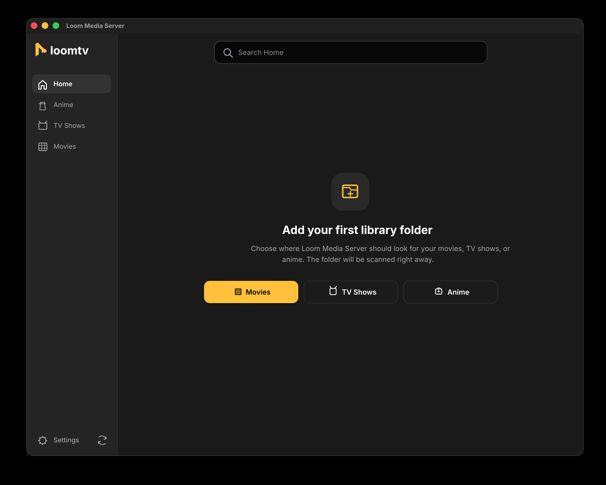

# LoomTV 1.0.5 Release Notes

LoomTV 1.0.5 focuses on making the first-run library flow and library sync reliable in the installed desktop app.

## Highlights

- Fixed library add and sync stalls caused by very large inline artwork payloads.
- Kept library responses lightweight by storing durable artwork URLs instead of embedded base64 image data.
- Added a local cached-artwork endpoint so posters can still load quickly without bloating library JSON.
- Moved remote artwork caching to a background queue after scans complete.
- Refreshed the scan cache version so existing libraries are rebuilt with the lighter metadata format.
- Bumped the app version to `1.0.5`.

## Validation

- `pnpm run package`
- `pnpm run verify:runtime`
- Smoke-tested `/api/library` and `/api/library/scan` with an existing local library and confirmed responses no longer include inline `data:image` artwork.

## Upgrade Notes

Existing library metadata is preserved. The next scan may refresh cached library entries because the scan cache version changed.
